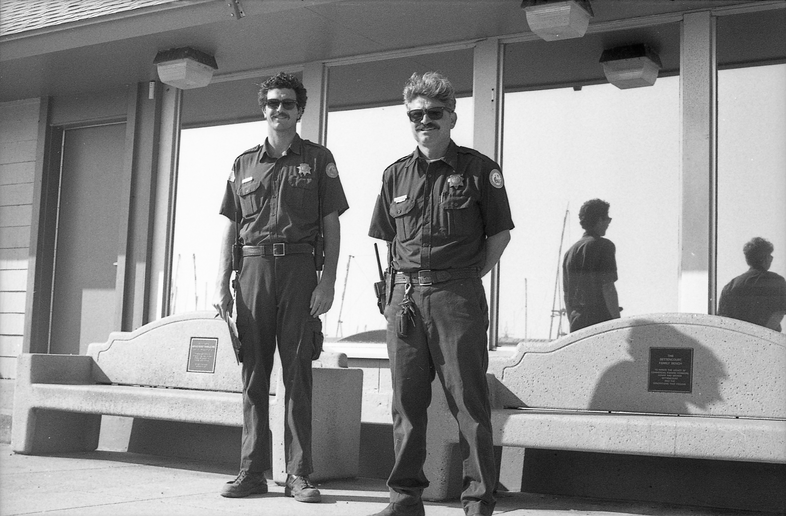
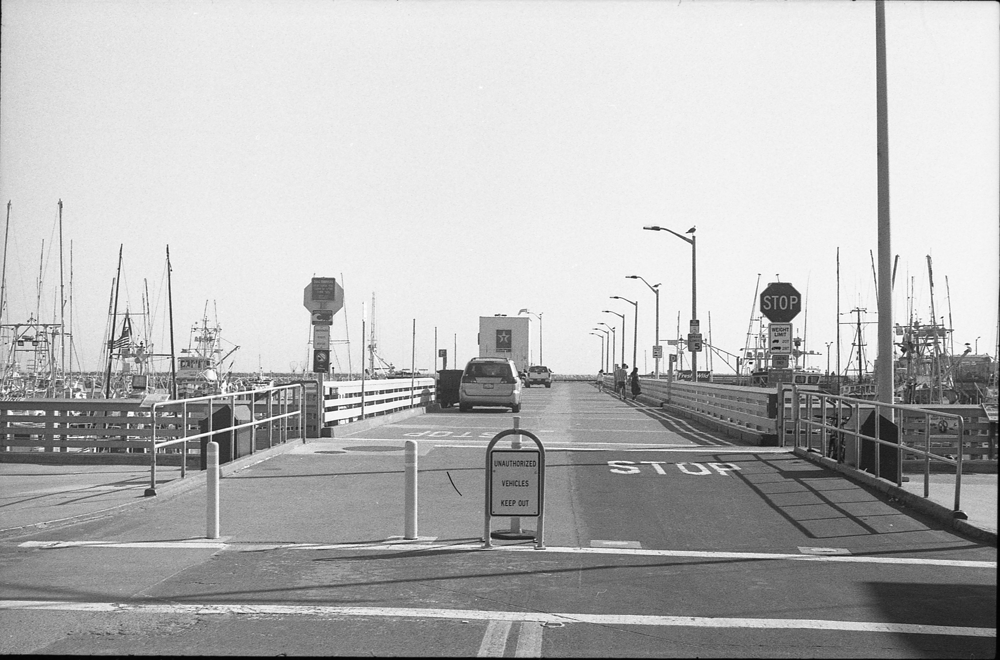
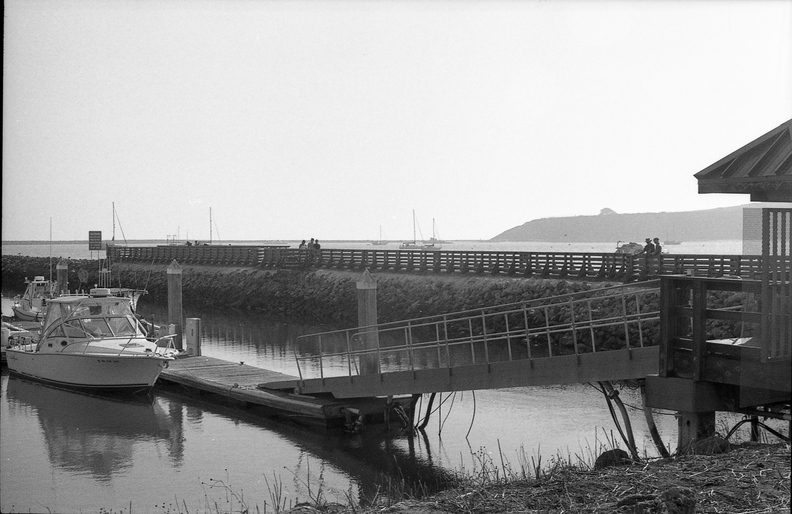

# Film_Photo_Portfolio
Film Portfolio

By Kai Lin

About:

This is my portfolio for my local harbor where my stepfather works and where I live with my mother. I have been doing black and white film photography for about 2 years now. I have been wanting to do a independent project relating to photography. That's when I realized that this harbor I have been living in for 4 years is such a large part of this community and yet, little is documented or spoken of. So I decided that it would be the perfect chance to both shed light onto a community and make a  portfolio.

<!--See [my picture](img011.jpeg) here. -->

<!-- HTML also works so: -->

</img>
</img>
</img>
</img>

 and you can create a link for a [standalone page](https://htmlpreview.github.io/?https://github.com/Kai-fujino-lin/Film_Photo_Portfolio/blob/ijonglin/make_link_in_readme/photo_index.html), if
you make it public.
